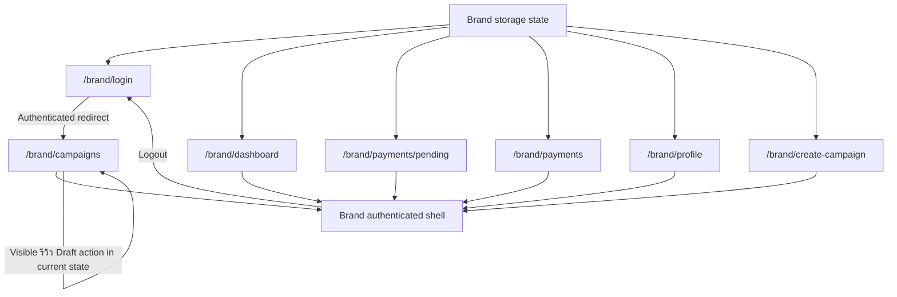

# Windflu Authenticated Brand Area Exploration

Exploration date: 2026-04-26

Scope: authenticated brand area only, using storage state generated by
`src/test/web-ui/brand-login.setup.ts`.

Authenticated storage state:

- Brand: `playwright/.auth/brand-storage.json`

Confidence level: 98%

## Authenticated Exploration Basis

- `src/test/web-ui/brand-login.setup.ts` currently generates reusable brand
  authenticated storage from the public brand login flow.
- The authenticated brand context retains `localStorage.isDev=true` from
  `playwright/.auth/windflu-dev-storage.json`.
- All route observations below were retested live on 2026-04-26 using the
  current brand storage state.

## Authenticated Exploration Summary

- A logged-in brand opening `/brand/login` is redirected to
  `/brand/campaigns`, which behaves as the current authenticated landing area.
- The brand account reaches a stable authenticated shell with persistent
  navigation across campaigns, dashboard, pending payments, payment history,
  profile, and create-campaign routes.
- Current seeded brand state is low-activity:
  `Jojoetest Company 20260425175634`, role `แบรนด์`, one visible campaign card,
  no pending payments, no payment history, and stable profile company details.
- `/brand/campaigns`, `/brand/dashboard`, `/brand/payments/pending`,
  `/brand/payments`, `/brand/profile`, and `/brand/create-campaign` all remain
  inside the brand area without redirecting to `/brand/login`.
- Logout exits the authenticated shell and returns the user to `/brand/login`.

## Page / Module Inventory

| Role  | Area             | Route                     | Current Observed Modules                                                                                           | Notes                                                                  |
| ----- | ---------------- | ------------------------- | ------------------------------------------------------------------------------------------------------------------ | ---------------------------------------------------------------------- |
| Brand | Shared shell     | brand-area routes         | Windflu logo, `สร้างแคมเปญ`, `แคมเปญ`, `ภาพรวม`, `ค้างชำระ`, `ประวัติการจ่ายเงิน`, `โปรไฟล์`, support link, logout | Shared brand navigation is stable across observed authenticated routes |
| Brand | Campaigns        | `/brand/campaigns`        | Campaign list heading `แคมเปญทั้งหมด`, create action, visible campaign card, review-draft action                   | Current seeded account shows one visible campaign card                 |
| Brand | Dashboard        | `/brand/dashboard`        | Brand overview heading, budget summary, content summary, running-campaign section                                  | Current seeded metrics display zeros                                   |
| Brand | Pending Payments | `/brand/payments/pending` | Pending-payments heading, refresh action, empty-state heading `ไม่มียอดค้างชำระ`                                   | Current account has no pending payments                                |
| Brand | Payment History  | `/brand/payments`         | Payment-history heading, refresh action, empty-state copy for no payment records                                   | Current account has no payment history                                 |
| Brand | Profile          | `/brand/profile`          | Brand profile heading, company summary, budget/plan section, company details, marketing goals, account info        | Current seeded profile data is stable and visible                      |
| Brand | Create Campaign  | `/brand/create-campaign`  | Multi-step campaign creation flow, step-1 heading `ข้อมูลหลักของแคมเปญ`, editor toolbar, step indicators           | Current route loads as an authenticated draft/create entry             |
| Brand | Logout exit      | from brand shell          | Logout action returns user to brand login                                                                          | Verified via DOM-triggered logout navigation                           |

## Authenticated Transition Flow

| Source              | Trigger / Condition            | Destination / Result                                   | Notes                                                            |
| ------------------- | ------------------------------ | ------------------------------------------------------ | ---------------------------------------------------------------- |
| Brand storage state | Open `/brand/login`            | Redirect to `/brand/campaigns`                         | Current authenticated landing behavior                           |
| Brand storage state | Open `/brand/campaigns`        | Campaign management page loads inside brand shell      | Visible campaign card and create action                          |
| Brand storage state | Open `/brand/dashboard`        | Brand dashboard loads inside authenticated shell       | No `/brand/login` redirect observed                              |
| Brand storage state | Open `/brand/payments/pending` | Pending-payments page loads inside authenticated shell | Current state is empty pending-payments inventory                |
| Brand storage state | Open `/brand/payments`         | Payment-history page loads inside authenticated shell  | Current state is empty payment-history inventory                 |
| Brand storage state | Open `/brand/profile`          | Profile page loads inside authenticated shell          | Stable company identity and account information are visible      |
| Brand storage state | Open `/brand/create-campaign`  | Create-campaign step-1 page loads inside brand shell   | Real authenticated create-campaign route is available            |
| Brand campaigns     | Trigger visible `รีวิว Draft`  | Campaigns page remains on `/brand/campaigns`           | Direct DOM click did not navigate during probe                   |
| Brand shell         | Trigger logout                 | `/brand/login`                                         | Verified via DOM click after pointer-click probe was intercepted |

## Mermaid Authenticated Flow Diagram

## QA Notes

- Authenticated brand assertions can move beyond route-only checks for
  campaigns, dashboard, pending payments, payment history, profile, and
  create-campaign because stable headings and seeded empty/baseline states were
  observed directly.
- The current reusable brand account has low financial activity, so payment
  assertions should stay aligned to the observed empty-state expectations
  unless seeded data changes.
- The create-campaign route is available and already loads a multi-step
  authenticated campaign-creation flow, which is a good candidate for later
  focused exploration or test design.
- The visible `รีวิว Draft` action on the current campaigns page did not
  navigate during probing, so treat it as unresolved behavior until a dedicated
  review-flow exploration confirms its intended action.
- Normal pointer clicks on some brand shell actions were intercepted by page
  layout layers during probing, but DOM-triggered clicks still proved the
  underlying navigation targets. Treat clickability carefully when designing
  automation for shell navigation and logout.
- Cookie controls remain visible in authenticated brand routes, so tests may
  need to dismiss or tolerate them.

## Test Design Handoff

Ready for authenticated test design:

- Brand authenticated landing redirect from `/brand/login`
- Brand campaigns baseline and visible campaign-card state
- Brand dashboard baseline
- Brand pending-payments empty state
- Brand payment-history empty state
- Brand profile baseline
- Brand create-campaign route access
- Authenticated logout destination

Blocked or assumption-based:

- Actual review-draft transition behavior
- Non-empty payment history
- Non-empty pending-payment state
- Downstream create-campaign submit/publish behavior
