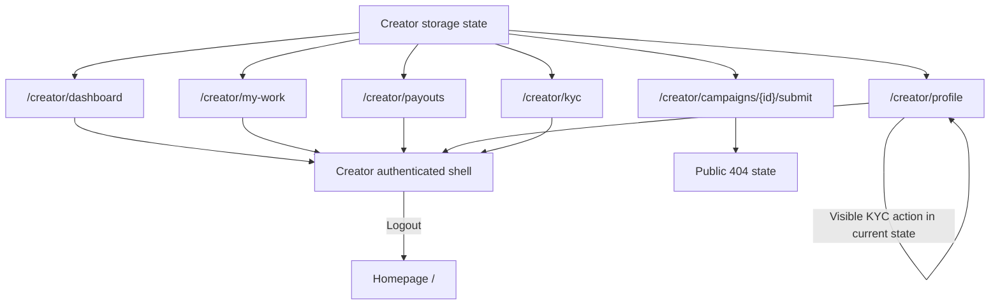
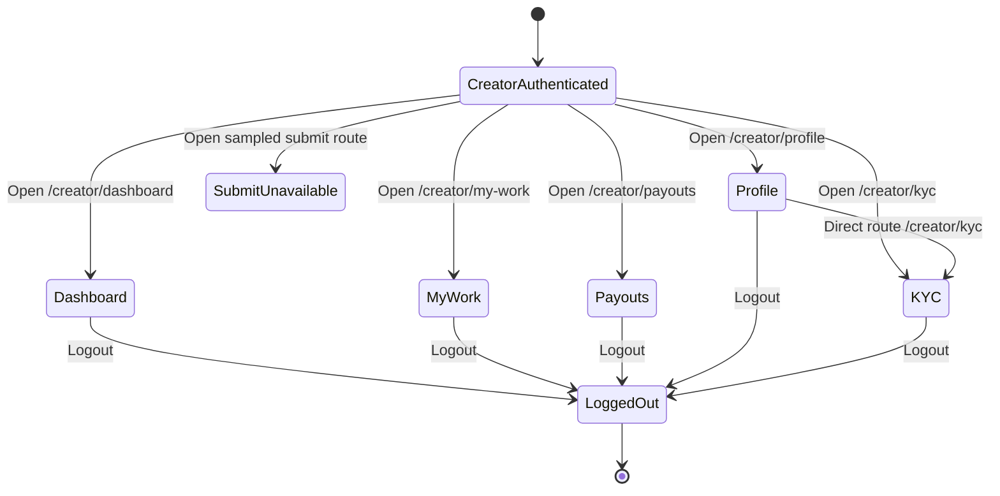

# Windflu Authenticated Creator Area Exploration

Exploration date: 2026-04-26

Scope: authenticated creator area only, using storage state generated by
`src/test/web-ui/creator-login.setup.ts`.

Authenticated storage state:

- Creator: `playwright/.auth/creator-storage.json`

Confidence level: 98%

## Authenticated Exploration Basis

- `src/test/web-ui/creator-login.setup.ts` currently generates reusable creator
  authenticated storage from the public creator login flow.
- The authenticated creator context retains `localStorage.isDev=true` from
  `playwright/.auth/windflu-dev-storage.json`.
- All route observations below were retested live on 2026-04-26 using the
  current creator storage state.

## Authenticated Exploration Summary

- The creator account reaches a stable authenticated shell with persistent top
  navigation and profile identity markers across dashboard, my-work, payouts,
  profile, and KYC routes.
- Current seeded account state is mostly empty and unverified:
  `jojoedisplay175623`, role `CLIPPER`, zero counts/earnings, and KYC status
  `ยังไม่ยืนยัน`.
- `/creator/dashboard`, `/creator/my-work`, `/creator/payouts`,
  `/creator/profile`, and `/creator/kyc` all stay inside the creator area
  without redirecting to `/login`.
- The sampled creator submit route
  `/creator/campaigns/69e61d06a282a107c2d34ff0/submit` does not enter a submit
  workflow for this account; it resolves to a public 404 page even when the
  user is authenticated.
- Logout exits the creator area and returns to homepage `/`.

## Page / Module Inventory

| Role    | Area            | Route                                                | Current Observed Modules                                                                  | Notes                                                                    |
| ------- | --------------- | ---------------------------------------------------- | ----------------------------------------------------------------------------------------- | ------------------------------------------------------------------------ |
| Creator | Shared shell    | creator-area routes                                  | Windflu logo, `แคมเปญ`, `ภาพรวม`, `งานของฉัน`, `การเงิน`, `โปรไฟล์`, support link, logout | Shared creator navigation is stable across observed authenticated routes |
| Creator | Dashboard       | `/creator/dashboard`                                 | Metrics cards, summary counts, `สรุปคุณภาพผลงาน`                                          | Current seeded account shows all counters at `0`                         |
| Creator | My Work         | `/creator/my-work`                                   | Work status summary, empty-state heading `ยังไม่มีผลงาน`, `ค้นหาแคมเปญ` button            | Seeded account has no submitted work                                     |
| Creator | Payouts         | `/creator/payouts`                                   | Balance summary, `ถอนเงิน` button, heading `ประวัติการถอนเงิน`                            | Withdrawable amount is `฿0`; minimum withdrawal note is visible          |
| Creator | Profile         | `/creator/profile`                                   | Display profile, personal data section, payment channel section, KYC status, save action  | Shows `ยังไม่ยืนยัน` KYC state and visible `ยืนยันตัวตน` action          |
| Creator | KYC             | `/creator/kyc`                                       | KYC heading, document-preparation instructions, submit-documents button                   | Current KYC route is accessible directly while authenticated             |
| Creator | Campaign Submit | `/creator/campaigns/69e61d06a282a107c2d34ff0/submit` | Public 404 state with `กลับสู่หน้าหลัก`                                                   | Current sampled route is not a valid authenticated submit entry          |
| Creator | Logout exit     | from creator shell                                   | Logout action returns user to public homepage                                             | Verified via DOM-triggered logout navigation                             |

## Authenticated Transition Flow

| Source                | Trigger / Condition        | Destination / Result                                     | Notes                                                                    |
| --------------------- | -------------------------- | -------------------------------------------------------- | ------------------------------------------------------------------------ |
| Creator storage state | Open `/creator/dashboard`  | Creator dashboard loads inside authenticated shell       | No `/login` redirect observed                                            |
| Creator storage state | Open `/creator/my-work`    | My-work page loads inside authenticated shell            | Current state is empty work inventory                                    |
| Creator storage state | Open `/creator/payouts`    | Payouts page loads inside authenticated shell            | Current state shows `฿0` available                                       |
| Creator storage state | Open `/creator/profile`    | Profile page loads inside authenticated shell            | KYC status currently `ยังไม่ยืนยัน`                                      |
| Creator storage state | Open `/creator/kyc`        | KYC page loads inside authenticated shell                | Heading `ยืนยันตัวตน (KYC)` is visible                                   |
| Creator profile       | Observe visible KYC action | Profile remains on `/creator/profile` after direct click | Visible `ยืนยันตัวตน` action did not navigate during probe               |
| Creator storage state | Open sampled submit route  | Public 404 page                                          | Authenticated session alone does not guarantee submit-route availability |
| Creator dashboard     | Trigger logout             | Homepage `/`                                             | Verified via DOM click after pointer-click probe was intercepted         |

## Mermaid Authenticated Flow Diagram

## Mermaid Authenticated State Diagram

## QA Notes

- Creator authenticated assertions can now move beyond route-only checks for
  dashboard, my-work, payouts, profile, and KYC because stable headings and
  seeded empty-state markers were observed directly.
- The current reusable creator account is low-activity and low-balance, so
  finance and work-history assertions should stay aligned to empty-state
  expectations unless seeded data changes.
- The current creator profile is not KYC-verified; this is a meaningful test
  state that should be preserved in authenticated coverage.
- The sampled submit route currently behaves like an unavailable resource even
  when authenticated. Submit-flow tests should not reuse that route as a known
  valid campaign path.
- Cookie controls remain visible in authenticated routes, so tests may need to
  dismiss or tolerate them.
- The visible `ออกจากระบบ` action did not accept a normal pointer click during
  probing because the page layout intercepted the click path, but a DOM click
  triggered a real logout to `/`. Treat logout UI automation carefully until a
  dedicated interaction check confirms the stable user-click path.

## Test Design Handoff

Ready for authenticated test design:

- Creator dashboard authenticated shell and metrics baseline
- Creator my-work empty state
- Creator payouts empty-balance state
- Creator profile baseline plus unverified KYC state
- Direct creator KYC page access
- Authenticated logout destination

Blocked or assumption-based:

- Valid authenticated creator submit flow for a real campaign route
- Non-empty work history
- Non-zero payouts / withdrawal history
