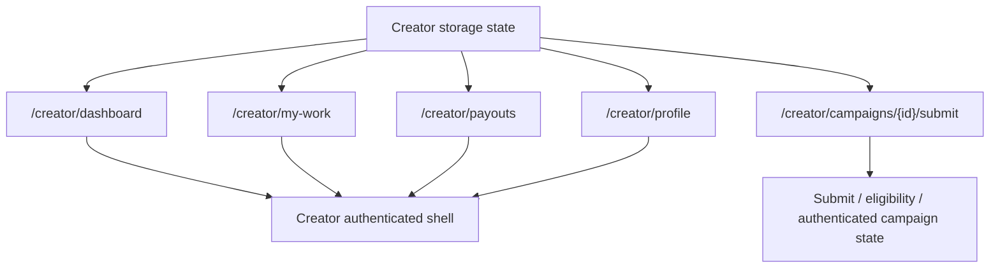
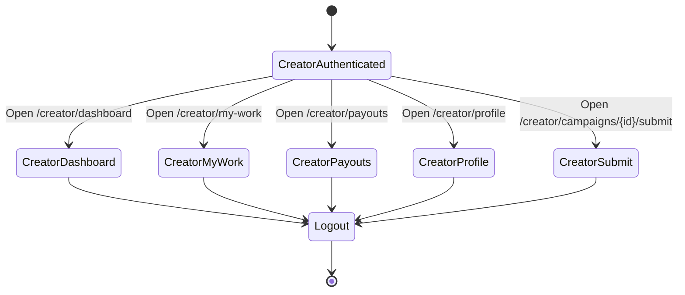

# Windflu Authenticated Area Exploration And Diagrams

Exploration date: 2026-04-24

Scope: authenticated creator areas only. This document is for tests that start
from creator authenticated storage state generated by
`src/test/web-ui/creator-login.setup.ts`.

Authenticated storage state:

- Creator: `playwright/.auth/creator-storage.json`

Confidence level: 86%

## Authenticated Exploration Basis

- `src/test/web-ui/creator-login.setup.ts` is the required entry point for creator
  authenticated coverage.
- Creator tests start from `creatorStorageStatePath`.
- Authenticated creator flow retains `localStorage.isDev=true` from
  `playwright/.auth/windflu-dev-storage.json`.
- Brand authenticated coverage is deferred because reusable brand registration
  and credentials do not exist yet.

## Authenticated Exploration Summary

- Creator authenticated coverage should stay inside creator routes without
  falling back to `/login`.
- Current creator scope targets dashboard, my-work, payouts, profile, and
  campaign submit.
- Detailed content assertions remain dependent on real seeded account data and
  successful authenticated exploration with valid credentials.

## Authenticated Module Inventory

| Role    | Area            | Route                                                | Authenticated Expectation                                                     | Notes                                                 |
| ------- | --------------- | ---------------------------------------------------- | ----------------------------------------------------------------------------- | ----------------------------------------------------- |
| Creator | Dashboard       | `/creator/dashboard`                                 | Creator remains inside creator area and authenticated shell/page is visible   | Use creator storage state                             |
| Creator | My Work         | `/creator/my-work`                                   | Creator remains inside creator area and work page/shell is visible            | Exact seeded content still unknown                    |
| Creator | Payouts         | `/creator/payouts`                                   | Creator remains inside creator area and payouts page/shell is visible         | Exact finance widgets still unknown                   |
| Creator | Profile         | `/creator/profile`                                   | Creator remains inside creator area and profile page/shell is visible         | Profile completion state may affect page details      |
| Creator | Campaign Submit | `/creator/campaigns/69e61d06a282a107c2d34ff0/submit` | Creator reaches authenticated submit/eligibility state without login redirect | Final state depends on campaign and account readiness |

## Authenticated Transition Flow

| Source                | Trigger / Condition        | Destination / Result                                  | Notes                                            |
| --------------------- | -------------------------- | ----------------------------------------------------- | ------------------------------------------------ |
| Creator storage state | Open `/creator/dashboard`  | Creator dashboard/authenticated shell loads           | Assert no `/login` redirect                      |
| Creator storage state | Open `/creator/my-work`    | Creator my-work/authenticated shell loads             | Refine when seeded work data is known            |
| Creator storage state | Open `/creator/payouts`    | Creator payouts/authenticated shell loads             | Refine when seeded payout data is known          |
| Creator storage state | Open `/creator/profile`    | Creator profile/authenticated shell loads             | May vary by profile completion                   |
| Creator storage state | Open campaign submit route | Submit/eligibility/authenticated campaign state loads | Depends on campaign status and creator readiness |

## Mermaid Authenticated Flow Diagram

## Mermaid Authenticated State Diagram

## QA Notes

- This authenticated design is currently creator-only.
- The first assertion in authenticated specs should be that the route stays
  outside the login page.
- Brand authenticated coverage should be added only after brand registration
  and reusable credentials exist.
