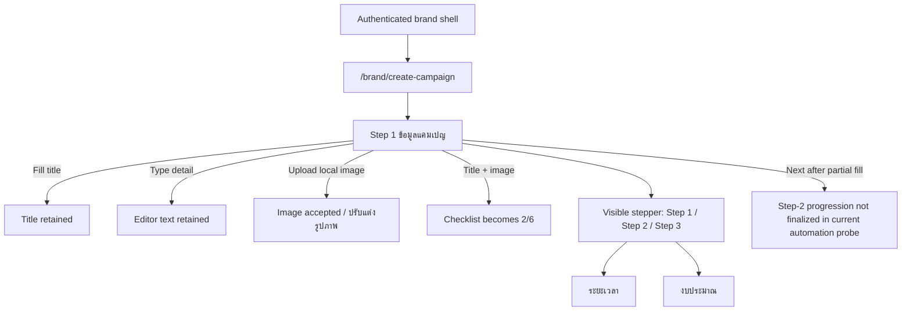

# Windflu Authenticated Brand Create-Campaign Exploration

Exploration date: 2026-04-26

Scope: authenticated brand create-campaign flow using the current reusable
brand account, local image asset `src/assets/campaign-image-1.jpg`, and the
provided campaign title/detail content.

Authenticated storage state:

- Brand: `playwright/.auth/brand-storage.json`

Exploration input used:

- Campaign title: `เดินเล่นเบา ๆ ทางไม่ไกล`
- Campaign detail seed:
  `บางครั้งการออกเดินทาง ไม่จำเป็นต้องไปไกลเสมอไป ... เดินเล่นเบา ๆ ทางไม่ไกล แต่ความสุขเกินระยะทาง`
- Image asset: `src/assets/campaign-image-1.jpg`

Confidence level: 96%

## Exploration Summary

- The authenticated brand account can open `/brand/create-campaign` directly
  from the brand shell.
- The route currently renders a three-step wizard:
  `ข้อมูลแคมเปญ`, `ระยะเวลา`, and `งบประมาณ`.
- Step 1 clearly exposes required fields for title, campaign detail, category,
  platform, and campaign image, plus optional requirement/link fields and a
  shipping checkbox.
- The provided local image file is accepted by the upload control, and the UI
  exposes a post-upload `ปรับแต่งรูปภาพ` state.
- The provided campaign title is recognized by the form state.
- In current automation probes, title plus image advanced the right-side
  checklist to `2/6 กรอกแล้ว`.
- Platform selection and full progression into step 2 were not conclusively
  finalized during today’s automation probes; the stepper is visible, but the
  live UI did not reliably expose distinct step-2/step-3 field sets after
  synthetic clicks.

## Page / Module Inventory

| Role  | Area                  | Route                    | Current Observed Modules                                                                                                       | Notes                                                               |
| ----- | --------------------- | ------------------------ | ------------------------------------------------------------------------------------------------------------------------------ | ------------------------------------------------------------------- |
| Brand | Create campaign shell | `/brand/create-campaign` | Shared brand shell, multi-step wizard header, live preview card, checklist                                                     | Authenticated route remains inside brand shell                      |
| Brand | Step 1: campaign info | `/brand/create-campaign` | Title input, rich-text detail editor, category select, platform selector, image upload, requirements, links, shipping checkbox | Primary data-entry step observed directly                           |
| Brand | Upload state          | `/brand/create-campaign` | Upload prompt, file constraints, post-upload `ปรับแต่งรูปภาพ` state                                                            | Local JPEG asset accepted during probe                              |
| Brand | Preview / checklist   | `/brand/create-campaign` | Live preview card, budget placeholders, checklist items `ชื่อแคมเปญ`, `แพลตฟอร์ม`, `รูปภาพ`, `วันที่แคมเปญ`, `งบประมาณ`, `CPM` | Checklist reacted to title and image updates                        |
| Brand | Stepper               | `/brand/create-campaign` | `ขั้นตอนที่ 1`, `2 ระยะเวลา`, `3 งบประมาณ`                                                                                     | Later-step buttons are visible but progression remains inconclusive |

## Observed Step-1 Surface

| Section         | Control / Content      | Current Observation                                       |
| --------------- | ---------------------- | --------------------------------------------------------- |
| Title           | `ชื่อแคมเปญ *`         | Input name is `title`; provided title is retained         |
| Detail          | `รายละเอียดแคมเปญ *`   | Rich-text editor is a contenteditable textbox             |
| Category        | `หมวดหมู่ *`           | Native select is present; current default value is `food` |
| Platform        | `แพลตฟอร์ม *`          | Rendered as a three-button grid, not a native input       |
| Image           | `รูปภาพแคมเปญ *`       | File input accepts local image asset                      |
| Requirements    | `เงื่อนไข Clipper`     | Free-text input with comma-separated guidance             |
| Attachment link | `ลิงก์แนบท้าย`         | Optional URL-style text field                             |
| Shipping        | `ส่งสินค้าให้ Clipper` | Checkbox is present                                       |

## Transition Flow

| Source                    | Trigger / Condition                      | Destination / Result                                  | Notes                                                         |
| ------------------------- | ---------------------------------------- | ----------------------------------------------------- | ------------------------------------------------------------- |
| Brand authenticated shell | Open `/brand/create-campaign`            | Create-campaign wizard loads                          | No `/brand/login` redirect observed                           |
| Step 1                    | Fill campaign title                      | Title state is retained                               | Provided title persisted in input value                       |
| Step 1                    | Type into rich-text editor               | Detail editor accepts text                            | Editor content was retained during probe                      |
| Step 1                    | Upload `src/assets/campaign-image-1.jpg` | Upload control accepts image                          | UI exposes `ปรับแต่งรูปภาพ` after upload                      |
| Step 1                    | Fill title + upload image                | Checklist updates to `2/6 กรอกแล้ว`                   | Title and image are definitely recognized by app state        |
| Step 1                    | Direct probe of platform grid            | Platform remains visually unresolved in automation    | Platform did not clearly increment checklist during probe     |
| Wizard header             | Observe stepper                          | Steps 1-3 are visible                                 | `ระยะเวลา` and `งบประมาณ` are present in stepper text         |
| Wizard progression        | Trigger `ถัดไป` after partial fill       | Progression did not settle conclusively in automation | Needs dedicated follow-up before relying on step-2 assertions |

## Mermaid Flow Diagram

## QA Notes

- The route is clearly a real authenticated create-campaign wizard, not just a
- placeholder page.
- The provided local image asset is suitable for future automation because it
  is accepted by the live upload control and respects the current file-type UI.
- The category field appears to default to `food`, so category may not need to
  be actively selected in every baseline path.
- The platform field is the main unresolved step-1 control under automation:
  it renders as a three-button grid with no visible text content in the DOM
  probe, and today’s synthetic interaction did not clearly move checklist state
  beyond `2/6`.
- The stepper shows steps 2 and 3, but direct automation clicks on those
  headers did not surface stable date/budget form fields during today’s probe.
- The route also inherits the broader brand-shell click-interception pattern
  seen elsewhere in authenticated brand exploration, so some actions may need
  DOM-triggered or carefully targeted automation until pointer behavior is
  stabilized.
- This exploration intentionally avoided any final publish/submit action.

## Test Design Handoff

Ready for test design:

- Authenticated access to `/brand/create-campaign`
- Step-1 field inventory and baseline UI assertions
- Campaign image upload acceptance using local asset
- Live preview / checklist baseline assertions
- Conservative partial-fill state assertions using the provided title and image

Blocked or assumption-based:

- Reliable automated platform selection behavior
- Confirmed transition from step 1 into step 2
- Step-2 date fields and validation rules
- Step-3 budget fields and validation rules
- Final publish / save / review behavior
