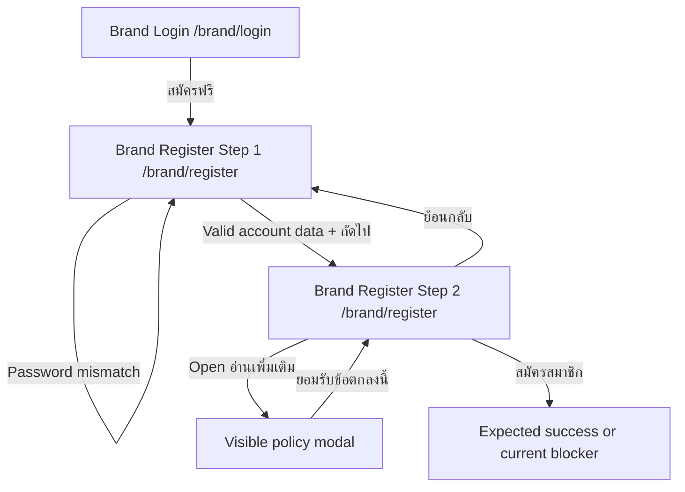

# Windflu Brand Registration Exploration

Exploration date: 2026-04-25

Scope: unauthenticated public brand registration at `/brand/register`.

Confidence level: 90%

## Exploration Summary

- Brand registration is a multi-step public flow that stays on
  `/brand/register`.
- Step 1 is account information entry.
- Step 2 is brand information entry plus visible policy acceptance.
- The currently exposed visible acceptance path is still blocked by incident
  `INC-002`, so successful completion remains a product issue rather than a
  missing exploration gap.

## Module Inventory

| Step | Visible Modules / Controls                                                                          | Notes                                         |
| ---- | --------------------------------------------------------------------------------------------------- | --------------------------------------------- |
| 1    | `ข้อมูลบัญชี`, contact name, email, password, confirm password, phone, `ถัดไป`                      | Mismatched passwords should block progression |
| 2    | `ข้อมูลแบรนด์`, company/brand name, industry combobox, `อ่านเพิ่มเติม →`, `ย้อนกลับ`, `สมัครสมาชิก` | Step 2 remains on `/brand/register`           |

## Transition Flow

| Source                | Trigger / Condition                           | Destination / Result         | Notes                                        |
| --------------------- | --------------------------------------------- | ---------------------------- | -------------------------------------------- |
| `/brand/login`        | Click `สมัครฟรี`                              | `/brand/register`            | Public brand registration entry              |
| Brand register step 1 | Click `ถัดไป` with empty/invalid data         | Remains on step 1            | Validation/progression block                 |
| Brand register step 1 | Click `ถัดไป` with mismatched passwords       | Remains on step 1            | Confirm-password validation                  |
| Brand register step 1 | Click `ถัดไป` with valid account data         | Step 2 visible               | Heading changes to `ข้อมูลแบรนด์`            |
| Brand register step 2 | Fill company name and choose industry         | Step 2 remains active        | Required visible fields                      |
| Brand register step 2 | Click `อ่านเพิ่มเติม →`                       | Policy modal/dialog opens    | Visible acceptance path                      |
| Brand register step 2 | Click `ยอมรับข้อตกลงนี้`                      | Returns to step 2            | Visible policy acceptance completes          |
| Brand register step 2 | Click `สมัครสมาชิก` with visible fields valid | Registration should complete | Live behavior currently blocked by `INC-002` |
| Brand register step 2 | Click `ย้อนกลับ`                              | Step 1 visible               | Back navigation within same route            |

## Mermaid Flow Diagram

## QA Notes

- Step 2 fields currently confirmed in implementation and design:
  company/brand name, industry selection, and visible policy acceptance.
- Current blocker evidence from live runs:
  `accept_privacy_policy_version, accept_terms_and_conditions_version, and accept_clipper_agreement_version are required`.
- Repeated retries later returned `too many requests`.

## Clarification Points

- Is there a hidden policy/version field expected by the backend that the UI
  does not currently expose?
- Should the visible policy modal cover privacy, terms, and clipper agreement
  separately instead of a single exposed acceptance action?

## Test Design Handoff

Ready for test design / implementation:

- Step-1 validation coverage
- Step-1 to step-2 progression coverage
- Step-2 visible-field coverage
- Expected-failure success-path coverage until `INC-002` is resolved
