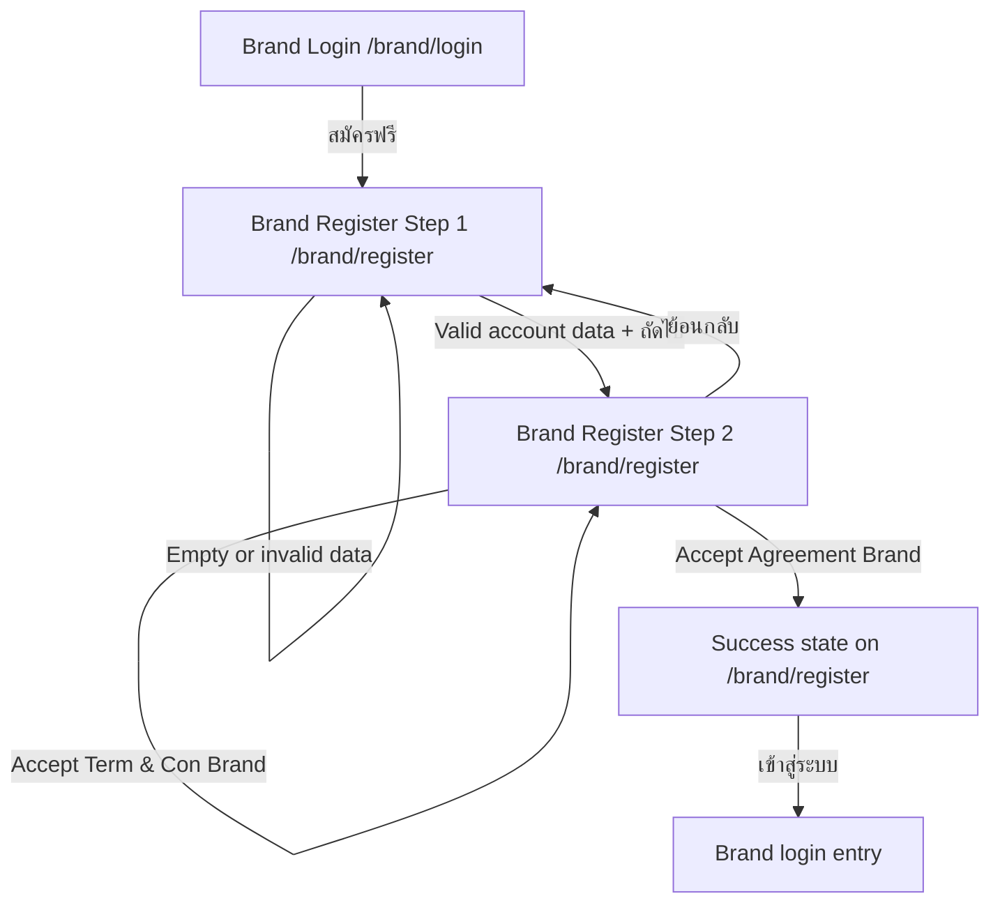

# Windflu Brand Registration Exploration

Exploration date: 2026-04-26

Scope: unauthenticated public brand registration at `/brand/register`,
including the current success completion behavior.

Confidence level: 98%

## Exploration Summary

- Brand registration remains a public 2-step flow that stays on
  `/brand/register`.
- Step 1 is still account information entry.
- Step 2 has changed from the previously observed modal-based policy flow to an
  inline policy-and-agreement section.
- The previous `INC-002` blocker no longer reproduced in today’s retest.
- Current live behavior shows successful completion on the same route after the
  three visible policy acceptances are completed with valid step-2 data.

## Module Inventory

| Step / State | Visible Modules / Controls                                                                                                                                             | Notes                                                                          |
| ------------ | ---------------------------------------------------------------------------------------------------------------------------------------------------------------------- | ------------------------------------------------------------------------------ |
| Step 1       | `ข้อมูลบัญชี`, contact name, company email, password, confirm password, phone, `ถัดไป`                                                                                 | Step title shown as `Brand Portal · ขั้นตอน 1/2`                               |
| Step 2       | `ข้อมูลแบรนด์`, company/brand name input, industry combobox, 3 inline policy cards (`Privacy Brand`, `Term & Con Brand`, `Agreement Brand`), `ย้อนกลับ`, `สมัครสมาชิก` | Step title shown as `Brand Portal · ขั้นตอน 2/2`                               |
| Success      | `สมัครสำเร็จแล้ว!`, welcome message, `เข้าสู่ระบบ`                                                                                                                     | Success state remains on `/brand/register`; submit button is no longer visible |

## Transition Flow

| Source                | Trigger / Condition                                         | Destination / Result               | Notes                                                                                                    |
| --------------------- | ----------------------------------------------------------- | ---------------------------------- | -------------------------------------------------------------------------------------------------------- |
| `/brand/login`        | Click `สมัครฟรี`                                            | `/brand/register`                  | Public brand registration entry                                                                          |
| Brand register step 1 | Click `ถัดไป` with empty/invalid data                       | Remains on step 1                  | Account-step validation still applies                                                                    |
| Brand register step 1 | Click `ถัดไป` with valid account data                       | Step 2 visible                     | `ข้อมูลแบรนด์` and `Brand Portal · ขั้นตอน 2/2` are shown                                                |
| Brand register step 2 | Fill company name and choose an industry                    | Step 2 remains active              | `สมัครสมาชิก` is still disabled while required policies remain unaccepted                                |
| Brand register step 2 | Accept `Privacy Brand`                                      | Step 2 remains active              | One inline policy acceptance toggled                                                                     |
| Brand register step 2 | Accept `Term & Con Brand`                                   | Step 2 remains active              | Second inline policy acceptance toggled                                                                  |
| Brand register step 2 | Accept `Agreement Brand` after valid visible data is filled | Success state on `/brand/register` | Success appeared immediately after the third visible acceptance in today’s retest                        |
| Brand register step 2 | Click `ย้อนกลับ`                                            | Step 1 visible                     | Back navigation remains available before completion                                                      |
| Success state         | Click `เข้าสู่ระบบ`                                         | Brand login entry                  | CTA is visible; route target was not re-opened because success confirmation was the exploration priority |

## Mermaid Flow Diagram

## QA Notes

- The old `อ่านเพิ่มเติม →` modal interaction is no longer part of the live
  step-2 brand flow.
- The live policy section now exposes three separate visible agreement cards
  with version tags (`V1.0.0`) and acceptance text for each card.
- The old backend validation error
  `accept_privacy_policy_version, accept_terms_and_conditions_version, and accept_clipper_agreement_version are required`
  was not reproduced in today’s retest.
- The success transition happened before any manual `สมัครสมาชิก` click could be
  re-applied, which suggests the final visible policy acceptance now triggers
  completion once the required visible fields are already valid.

## Test Design Handoff

Ready for test design / implementation:

- Step-1 validation coverage
- Step-1 to step-2 progression coverage
- Step-2 inline policy-card coverage
- Positive success-path coverage for valid brand registration
- Success-state CTA coverage for the visible `เข้าสู่ระบบ` action
