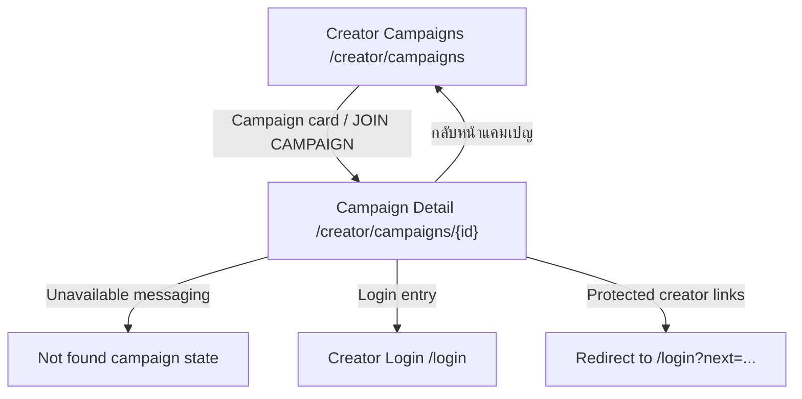

# Windflu Campaign Detail Exploration

Exploration date: 2026-04-25

Scope: unauthenticated public campaign detail browsing at
`/creator/campaigns/69e61d06a282a107c2d34ff0`.

Confidence level: 97%

## Exploration Summary

- Campaign detail route is publicly reachable for unauthenticated users, but
  the currently referenced campaign ID resolves to an unavailable/not-found
  state instead of a live campaign.
- The current page exposes unavailable-state messaging, a safe return link back
  to campaign listing, visible login entry, and creator-session links that
  remain auth-gated for guests.
- This flow is separate from the general unauthenticated actions document so
  campaign-detail behavior can be maintained independently.

## Page / Module Inventory

| Area            | Page / Route                                  | Visible Modules                                                                 | Notes                                               |
| --------------- | --------------------------------------------- | ------------------------------------------------------------------------------- | --------------------------------------------------- |
| Campaign Detail | `/creator/campaigns/69e61d06a282a107c2d34ff0` | Unavailable-state messaging, back link, creator sidebar, login entry, cookie UI | Current campaign ID does not render a live campaign |

## Transition Flow

| Source           | Trigger / Condition                    | Destination / Result                    | Notes                                          |
| ---------------- | -------------------------------------- | --------------------------------------- | ---------------------------------------------- |
| Campaign Listing | Open referenced campaign detail route  | Campaign unavailable state              | Current public state for the known campaign ID |
| Campaign Detail  | Click back campaign link               | `/creator/campaigns`                    | Listing return                                 |
| Campaign Detail  | Review unavailable-state content       | Same page stable messaging              | `ไม่พบแคมเปญ` visible                          |
| Campaign Detail  | Open dashboard/my-work/payouts/profile | Redirect to login with `next` parameter | Observed auth-gate behavior                    |
| Campaign Detail  | Click login entry                      | `/login` or `/login?next=...`           | Public login path remains available            |

## Mermaid Navigation Flow Diagram

## QA Notes

- Public campaign detail is part of unauthenticated coverage, but the current
  campaign ID behaves like a missing campaign.
- Legacy tab/calculator/share assertions are no longer valid for this route in
  the current environment.
- Protected creator-session routes redirect guests to `/login?next=...`.

## Test Design Handoff

Ready for unauthenticated test design:

- Public unavailable-state page load
- Safe return navigation to campaign listing
- Conservative guest login entry checks
- Guest auth-gate coverage for creator-session routes

Blocked or assumption-based:

- Whether this campaign ID should later resolve to a live public campaign again
