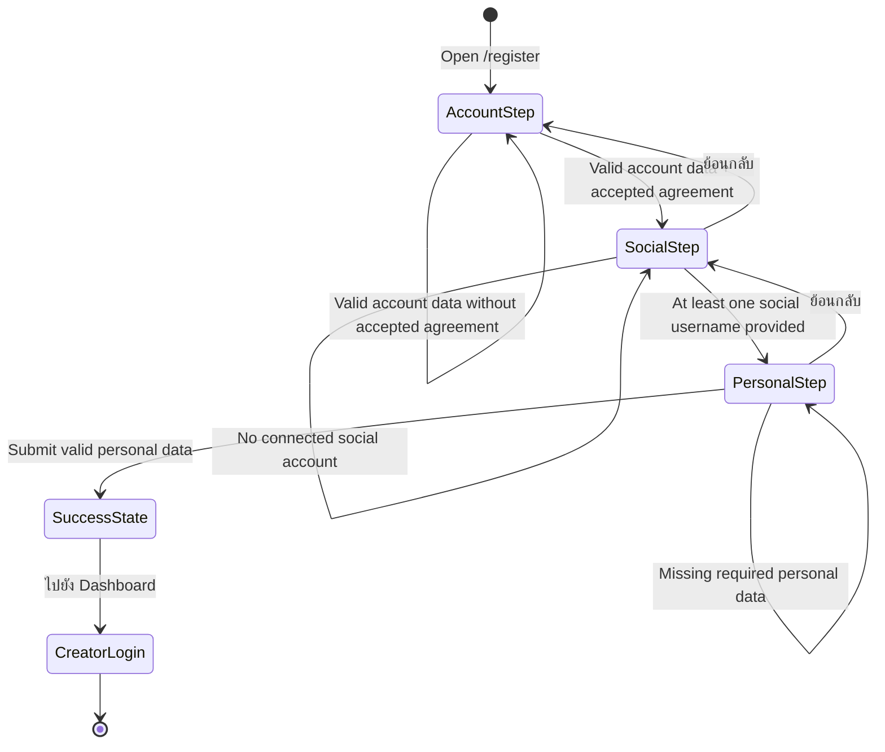

# Windflu Creator Registration Exploration

Exploration date: 2026-04-26

Scope: unauthenticated public creator registration at `/register`, including
the current success completion behavior.

Confidence level: 98%

## Exploration Summary

- Creator registration is publicly reachable from creator login and remains a
  3-step flow.
- The observed visible step sequence is:
  `Account -> Social -> Personal`.
- Account-step validation, the custom legal-acceptance control, social-step
  progression rules, personal-step blank validation, and the final success
  state are now directly observed.
- Successful submission currently keeps the user on `/register`, shows
  `สมัครเรียบร้อยแล้ว!`, and exposes a `ไปยัง Dashboard` CTA.
- The post-success CTA currently redirects unauthenticated users to
  `/login?next=%2Fcreator%2Fdashboard`.

## Module Inventory

| Step / Area | Visible Modules / Controls                                                                                | Notes                                                                  |
| ----------- | --------------------------------------------------------------------------------------------------------- | ---------------------------------------------------------------------- |
| Account     | Email, password, confirm password, custom agreement toggle button, terms link, privacy link, `ถัดไป`      | Empty submit shows inline validation and requires agreement acceptance |
| Social      | `แพลตฟอร์มหลัก TikTok`, TikTok username, Instagram username, `ย้อนกลับ`, `ถัดไป`                          | At least one social account is required to continue                    |
| Personal    | First name, last name, display name, phone, country select (`Thailand`, `Other`), `ย้อนกลับ`, `ลงทะเบียน` | Blank submit shows inline validation for the text fields               |
| Success     | `สมัครเรียบร้อยแล้ว!`, welcome text, `ไปยัง Dashboard`                                                    | Success remains on `/register` before redirecting via CTA              |

## Transition Flow

| Source           | Trigger / Condition                                 | Destination / Result                 | Notes                                                     |
| ---------------- | --------------------------------------------------- | ------------------------------------ | --------------------------------------------------------- |
| `/login`         | Click register link                                 | `/register`                          | Public creator registration entry                         |
| Creator register | Open terms or privacy links                         | Policy pages                         | Legal agreement links open public policy routes           |
| Account step     | Click `ถัดไป` with empty fields                     | Remains on account step              | Shows email/password/confirm/agreement validation         |
| Account step     | Valid account data without accepted agreement       | Remains on account step              | Shows `กรุณายอมรับเงื่อนไขการใช้งาน`                      |
| Account step     | Valid account data + accepted agreement             | Social step                          | Directly observed                                         |
| Social step      | Click `ถัดไป` with no social username               | Remains on social step               | Shows `เชื่อมอย่างน้อย 1 บัญชี เพื่อเริ่มรับงาน`          |
| Social step      | Fill at least one social username and click `ถัดไป` | Personal step                        | Directly observed with TikTok username                    |
| Social step      | Click `ย้อนกลับ`                                    | Account step                         | Back navigation is visible                                |
| Personal step    | Click `ลงทะเบียน` with blank personal fields        | Remains on personal step             | Shows required-field validation for name/display/phone    |
| Personal step    | Click `ย้อนกลับ`                                    | Social step                          | Back navigation is visible                                |
| Personal step    | Submit valid personal data                          | Success state on `/register`         | Shows `สมัครเรียบร้อยแล้ว!` and `ไปยัง Dashboard`         |
| Success state    | Click `ไปยัง Dashboard`                             | `/login?next=%2Fcreator%2Fdashboard` | Guest user is redirected to creator login with `next` set |

## Mermaid State Diagram

## QA Notes

- Creator `/register` is part of unauthenticated coverage and should no longer
  be buried inside the broad public exploration file.
- The legal acceptance control is implemented as a custom button next to the
  agreement label, not as a standard checkbox input.
- Current social-step baseline expects at least one linked social account
  username before progression.
- Current personal-step blank validation explicitly covers first name, last
  name, display name, and phone number.
- The success state currently remains on `/register` rather than immediately
  navigating away.
- The visible success CTA does not appear to establish an authenticated session
  automatically; it routes guests to `/login?next=%2Fcreator%2Fdashboard`.

## Test Design Handoff

Ready for test design:

- Public access to `/register`
- Account-step validation and legal-link coverage
- Agreement-required progression from account to social step
- Social-step validation for missing connected accounts
- Social-step progression when at least one social username is provided
- Personal-step blank validation for required profile fields
- Back navigation between steps
- Positive success-path coverage for creator registration
- Success-state CTA redirect coverage
