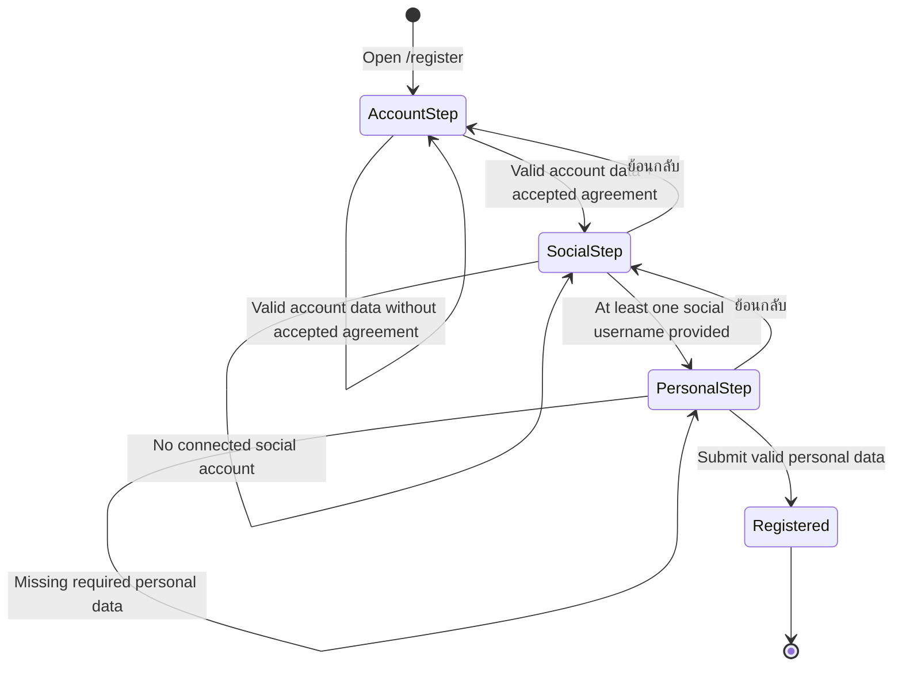

# Windflu Creator Registration Exploration

Exploration date: 2026-04-25

Scope: unauthenticated public creator registration at `/register`.

Confidence level: 97%

## Exploration Summary

- Creator registration is publicly reachable from creator login and appears to
  be a 3-step flow.
- The observed visible step sequence is:
  `Account -> Social -> Personal`.
- Account-step validation, the custom legal-acceptance control, social-step
  progression rules, and personal-step blank validation are now directly
  observed.
- Final successful registration submission was not executed, so completion
  behavior remains intentionally out of scope for this exploration pass.

## Module Inventory

| Step / Area | Visible Modules / Controls                                                                                | Notes                                                                  |
| ----------- | --------------------------------------------------------------------------------------------------------- | ---------------------------------------------------------------------- |
| Account     | Email, password, confirm password, custom agreement toggle button, terms link, privacy link, `ถัดไป`      | Empty submit shows inline validation and requires agreement acceptance |
| Social      | `แพลตฟอร์มหลัก TikTok`, TikTok username, Instagram username, `ย้อนกลับ`, `ถัดไป`                          | At least one social account is required to continue                    |
| Personal    | First name, last name, display name, phone, country select (`Thailand`, `Other`), `ย้อนกลับ`, `ลงทะเบียน` | Blank submit shows inline validation for the text fields               |

## Transition Flow

| Source           | Trigger / Condition                                 | Destination / Result     | Notes                                                   |
| ---------------- | --------------------------------------------------- | ------------------------ | ------------------------------------------------------- |
| `/login`         | Click register link                                 | `/register`              | Public creator registration entry                       |
| Creator register | Open terms or privacy links                         | Policy pages             | Legal agreement links open public policy routes         |
| Account step     | Click `ถัดไป` with empty fields                     | Remains on account step  | Shows email/password/confirm/agreement validation       |
| Account step     | Valid account data without accepted agreement       | Remains on account step  | Shows `กรุณายอมรับเงื่อนไขการใช้งาน`                    |
| Account step     | Valid account data + accepted agreement             | Social step              | Directly observed                                       |
| Social step      | Click `ถัดไป` with no social username               | Remains on social step   | Shows `เชื่อมอย่างน้อย 1 บัญชี เพื่อเริ่มรับงาน`        |
| Social step      | Fill at least one social username and click `ถัดไป` | Personal step            | Directly observed with TikTok username                  |
| Social step      | Click `ย้อนกลับ`                                    | Account step             | Back navigation is visible                              |
| Personal step    | Click `ลงทะเบียน` with blank personal fields        | Remains on personal step | Shows required-field validation for name/display/phone  |
| Personal step    | Click `ย้อนกลับ`                                    | Social step              | Back navigation is visible                              |
| Personal step    | Submit valid personal data                          | Registered result        | Final success behavior not executed in this exploration |

## Mermaid State Diagram

## QA Notes

- Creator `/register` is part of unauthenticated coverage and should no longer
  be buried inside the broad public exploration file.
- The legal acceptance control is implemented as a custom button next to the
  agreement label, not as a standard checkbox input.
- Current social-step baseline expects at least one linked social account
  username before progression.
- Current personal-step blank validation explicitly covers first name, last
  name, display name, and phone number.
- Final successful completion behavior should be explored separately before
  adding end-to-end creator registration automation that actually submits the
  public form.

## Test Design Handoff

Ready for test design:

- Public access to `/register`
- Account-step validation and legal-link coverage
- Agreement-required progression from account to social step
- Social-step validation for missing connected accounts
- Social-step progression when at least one social username is provided
- Personal-step blank validation for required profile fields
- Back navigation between steps

Needs fresh exploration before deep automation:

- Final completion behavior
