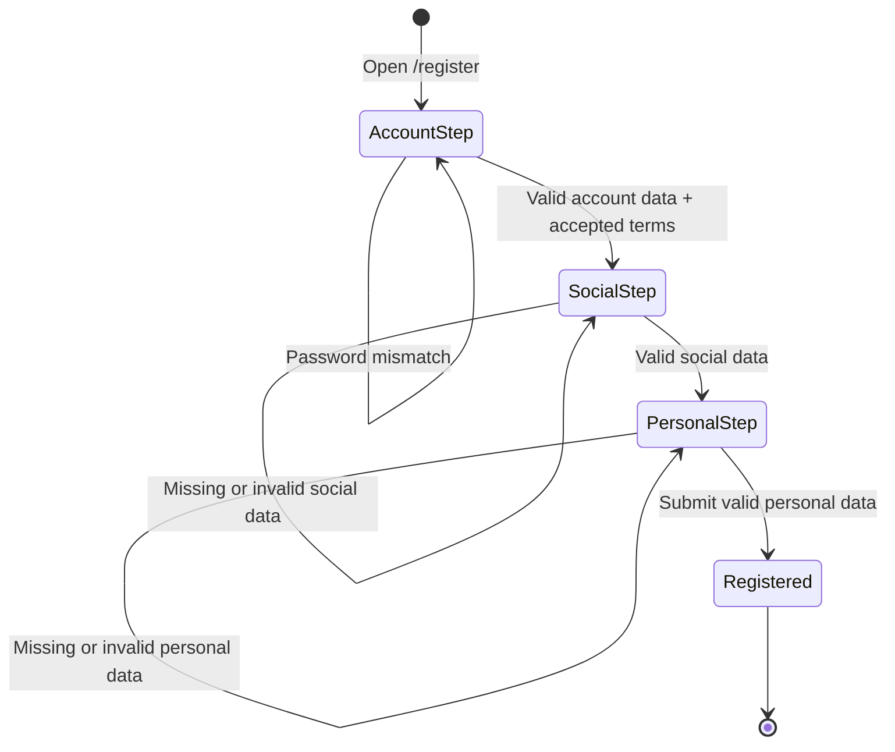

# Windflu Creator Registration Exploration

Exploration date: 2026-04-25

Scope: unauthenticated public creator registration at `/register`.

Confidence level: 83%

## Exploration Summary

- Creator registration is publicly reachable from creator login and appears to
  be a multi-step flow.
- The previously captured visible step sequence is:
  `Account -> Social -> Personal`.
- Detailed field-by-field coverage is less certain than brand registration, so
  this exploration remains a structured draft with assumptions.

## Module Inventory

| Step / Area | Visible Modules / Controls                                    | Notes                                  |
| ----------- | ------------------------------------------------------------- | -------------------------------------- |
| Account     | Email, password, confirm password, accept terms/privacy, next | Public entry confirmed                 |
| Social      | Social-profile related input area                             | Derived from prior exploration summary |
| Personal    | Personal-information related input area                       | Derived from prior exploration summary |

## Transition Flow

| Source           | Trigger / Condition                     | Destination / Result     | Notes                                |
| ---------------- | --------------------------------------- | ------------------------ | ------------------------------------ |
| `/login`         | Click register link                     | `/register`              | Public creator registration entry    |
| Creator register | Open terms or privacy links             | Policy pages             | Legal agreement links are exposed    |
| Account step     | Empty/invalid account data              | Remains on account step  | Validation expected                  |
| Account step     | Password mismatch                       | Remains on account step  | Validation expected                  |
| Account step     | Valid account data + accepted agreement | Social step              | Prior exploration evidence           |
| Social step      | Missing/invalid social data             | Remains on social step   | Prior exploration evidence           |
| Social step      | Valid social data                       | Personal step            | Prior exploration evidence           |
| Personal step    | Missing/invalid personal data           | Remains on personal step | Prior exploration evidence           |
| Personal step    | Submit valid personal data              | Registered result        | Final success not recently re-probed |

## Mermaid State Diagram

## QA Notes

- Creator `/register` is part of unauthenticated coverage and should no longer
  be buried inside the broad public exploration file.
- The exact field set for Social and Personal steps should be re-probed before
  writing deep assertions or full automation coverage.
- This document is lower confidence than the brand registration exploration
  because current repo evidence is lighter.

## Clarification Points

- What are the exact required fields in the Social and Personal steps?
- Does creator registration end in direct success, verification, or redirect to
  login?
- Are social-account links mandatory before completion?

## Test Design Handoff

Ready for conservative test design:

- Public access to `/register`
- Account-step validation and legal-link coverage
- Step progression assumptions as draft cases only

Needs fresh exploration before deep automation:

- Social-step field assertions
- Personal-step field assertions
- Final completion behavior
