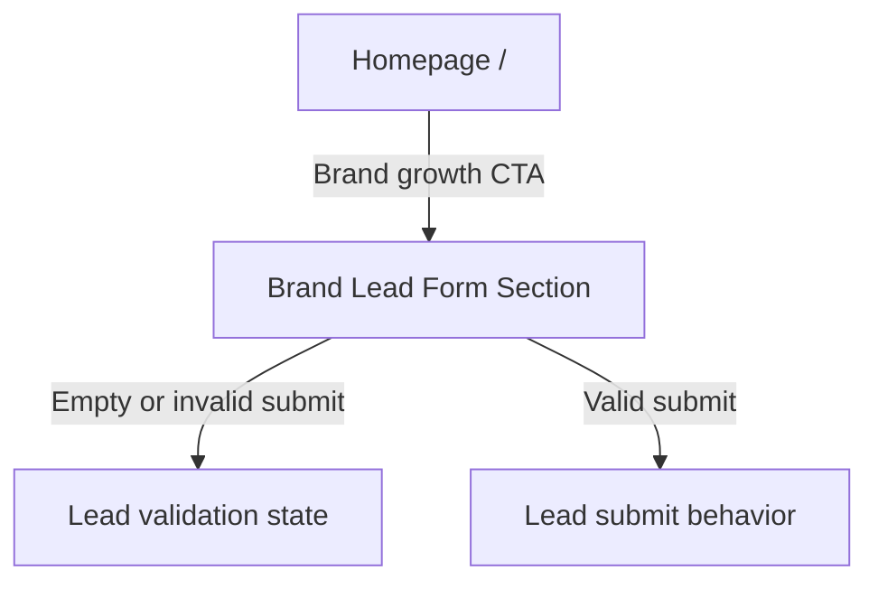

# Windflu Homepage Brand Lead Form Exploration

Exploration date: 2026-04-25

Scope: unauthenticated homepage lead-form behavior reached from the brand growth
CTA on `/`.

Confidence level: 96%

## Exploration Summary

- The homepage exposes a public brand growth CTA that scrolls to a lead-form
  section on the same page.
- This flow is kept separate from the broad unauthenticated-actions document so
  lead-capture behavior can evolve independently.
- Submission behavior should be treated as its own coverage area rather than
  bundled into generic homepage browsing.

## Page / Module Inventory

| Area               | Page / Route | Visible Modules                                                        | Notes                                           |
| ------------------ | ------------ | ---------------------------------------------------------------------- | ----------------------------------------------- |
| Homepage lead form | `/`          | Brand growth CTA, lead-form section, public lead fields, submit action | Form is publicly visible from the homepage flow |

## Transition Flow

| Source    | Trigger / Condition     | Destination / Result        | Notes                                                               |
| --------- | ----------------------- | --------------------------- | ------------------------------------------------------------------- |
| Homepage  | Click brand growth CTA  | Same-page lead-form section | Scroll transition                                                   |
| Lead form | Empty or invalid submit | Validation / blocked submit | Exact validation copy not documented here                           |
| Lead form | Valid submit attempt    | Submission behavior         | Backend submission behavior should be explored/validated separately |

## Mermaid Navigation Flow Diagram

## QA Notes

- The lead form is public and is part of unauthenticated coverage.
- This document intentionally separates lead-capture behavior from general
  homepage browsing.
- Final backend submission expectations should be confirmed before deep
  automation assertions are written.

## Test Design Handoff

Ready for test design:

- CTA scroll-to-form behavior
- Public form visibility
- Conservative validation-state coverage

Needs further exploration before deep assertion coverage:

- Final successful submission behavior
- Server-side validation and post-submit state
