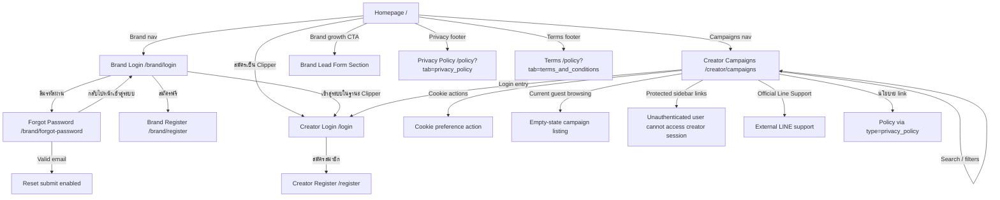

# Windflu Unauthenticated User Actions Exploration

Exploration date: 2026-04-25

Scope: public/unauthenticated Windflu website using
`playwright/.auth/windflu-dev-storage.json` with `localStorage.isDev=true`.

Related focused exploration files:

- `src/test-design/exploration-homepage-brand-lead-form.md`
- `src/test-design/exploration-brand-register-flow.md`
- `src/test-design/exploration-creator-register-flow.md`
- `src/test-design/exploration-campaign-detail.md`

Confidence level: 96%

## Exploration Summary

- Unauthenticated users can browse the homepage, public campaign discovery,
  legal policy pages, brand auth entry pages, and creator auth entry pages.
- The main guest journeys are browse, discover, switch between creator and
  brand entry points, start login/register/forgot-password flows, and navigate
  into public campaign discovery before any protected action.
- Detailed homepage brand lead behavior, registration behavior, and deep
  campaign-detail behavior are intentionally split into dedicated exploration
  files so this document can stay focused on general guest actions.

## Unauthenticated Journey Inventory

| Journey                     | Entry Point              | Main User Actions                                                                | Current Observed Result                                                           |
| --------------------------- | ------------------------ | -------------------------------------------------------------------------------- | --------------------------------------------------------------------------------- |
| Homepage browsing           | `/`                      | Read marketing content, inspect workflow, use nav, click footer links            | Public homepage is available                                                      |
| Brand auth entry            | `/brand/login`           | Login attempt, switch to register, switch to forgot-password, switch to creator  | Public auth entry is available                                                    |
| Brand forgot-password entry | `/brand/forgot-password` | Enter email, verify submit enablement, return to login                           | Public recovery entry is available                                                |
| Brand registration entry    | `/brand/register`        | Start registration flow                                                          | Detailed flow moved to dedicated file                                             |
| Creator auth entry          | `/login`                 | Choose email login, use register link                                            | Public creator login entry is available                                           |
| Creator registration entry  | `/register`              | Start creator registration flow                                                  | Detailed flow moved to dedicated file                                             |
| Campaign browsing           | `/creator/campaigns`     | Accept cookie banner, search, filter, review empty state and support/login links | Campaign list is publicly accessible; current environment shows empty state       |
| Legal / policy browsing     | `/policy?...`            | Open privacy tab, terms tab, navigate from footer and campaign-related links     | Public legal content is available with stable long-form privacy and terms content |

## Page / Module Inventory

| Area                  | Page / Route                                                     | Visible Modules                                                                                          | Notes                                                                      |
| --------------------- | ---------------------------------------------------------------- | -------------------------------------------------------------------------------------------------------- | -------------------------------------------------------------------------- |
| Homepage              | `/`                                                              | Header nav, hero CTAs, creator workflow, brand lead CTA, footer links                                    | Brand lead-form detail moved to dedicated exploration file                 |
| Brand Login           | `/brand/login`                                                   | Email, password, visibility toggle, login, register, forgot-password, creator login link                 | No authenticated dashboard explored                                        |
| Brand Forgot Password | `/brand/forgot-password`                                         | Email field, disabled reset submit until valid input, back-login link                                    | Reset email not submitted                                                  |
| Creator Login         | `/login`                                                         | Google login, email login, register link                                                                 | Email login sub-flow is available                                          |
| Campaign Listing      | `/creator/campaigns`                                             | Sidebar nav, cookie banner, search, platform filters, category filters, empty-state, support/login links | Sidebar protected links are visible to unauthenticated users               |
| Policy                | `/policy?tab=privacy_policy`, `/policy?tab=terms_and_conditions` | Privacy/terms tabs, long legal content, footer links                                                     | Current headings include `Privacy Policy Clipper` and `Terms & Conditions` |

## Transition Flow

| Source                   | Trigger / Condition                    | Destination / Result                    | Notes                                                          |
| ------------------------ | -------------------------------------- | --------------------------------------- | -------------------------------------------------------------- |
| Homepage                 | Click brand nav                        | `/brand/login`                          | Brand portal entry                                             |
| Homepage                 | Click Campaigns nav                    | `/creator/campaigns`                    | Public campaign discovery                                      |
| Homepage                 | Click `สมัครเป็น Clipper`              | `/login`                                | Creator login entry                                            |
| Homepage                 | Click brand growth CTA                 | Same page lead form section             | Detailed lead-form behavior documented separately              |
| Homepage footer          | Click privacy                          | `/policy?tab=privacy_policy`            | Public legal page                                              |
| Homepage footer          | Click terms                            | `/policy?tab=terms_and_conditions`      | Public legal page                                              |
| Brand Login              | Click `สมัครฟรี`                       | `/brand/register`                       | Detailed behavior documented separately                        |
| Brand Login              | Click `ลืมรหัสผ่าน?`                   | `/brand/forgot-password`                | Recovery entry                                                 |
| Brand Login              | Click creator login link               | `/login`                                | Switch role entry                                              |
| Brand Forgot Password    | Valid email input                      | Reset submit becomes enabled            | Reset action not executed                                      |
| Creator Login            | Click register link                    | `/register`                             | Detailed behavior documented separately                        |
| Campaign Listing         | Click cookie actions                   | Banner action invoked                   | Banner did not reliably disappear during prior automation      |
| Campaign Listing         | Search/filter controls                 | Campaign list updates or remains stable | Current environment stays in empty state during guest browsing |
| Campaign Listing         | Review public support/login actions    | Safe public links remain available      | Login/support links visible even without campaign cards        |
| Campaign Listing sidebar | Open dashboard/my-work/payouts/profile | Redirect to login with `next` parameter | Observed on live site                                          |

## Mermaid Navigation Flow Diagram

## QA Notes

- Public site behavior depends on `localStorage.isDev=true`; without it, the
  site can show a coming-soon page.
- Policy content now appears stable enough for deeper assertion coverage:
  privacy shows `Privacy Policy Clipper` `V1.0.0` and terms shows
  `Terms & Conditions` `V1.0.1`, both dated `25 เมษายน 2569`.
- Campaign cookie actions are visible, but prior automation showed the banner
  does not reliably disappear after synthetic accept.
- Current guest campaign listing is in empty state, so campaign-card assertions
  should stay out of the baseline unauthenticated suite until seeded public
  data is available again.
- Unauthenticated users should not be able to access creator-session-only
  routes such as dashboard, my-work, payouts, or profile; current behavior
  redirects to `/login?next=...`.
- `/contact` remains tracked in incident `INC-001` until implementation is
  complete.
- Homepage brand lead-form behavior was moved into a dedicated exploration
  file.
- Registration-specific field-by-field and state-by-state details were moved
  into dedicated brand and creator registration exploration files.
- Campaign-detail-specific controls and transitions were moved into a dedicated
  exploration file.

## Test Design Handoff

Ready for unauthenticated test design:

- Homepage browsing
- Brand login and forgot-password entry flows
- Creator login entry flow
- Campaign listing browsing
- Conservative policy-navigation coverage without locking content details

Covered separately in dedicated exploration files:

- Homepage brand lead form
- Brand registration flow
- Creator registration flow
- Campaign detail flow

Blocked or assumption-based:

- `/contact` until implementation completes
- Authenticated dashboards
- Payout/finance behavior
- Brand campaign creation/review flows
