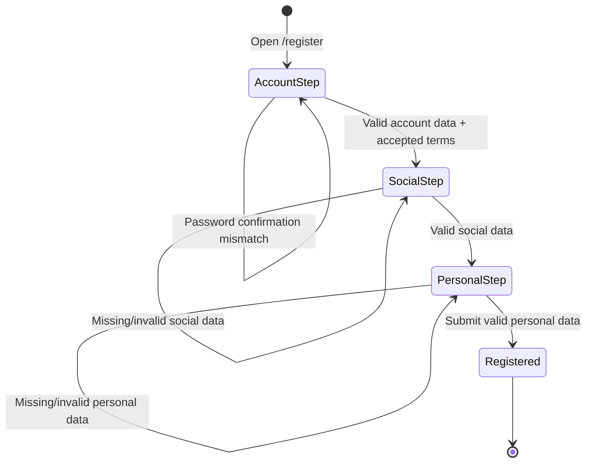
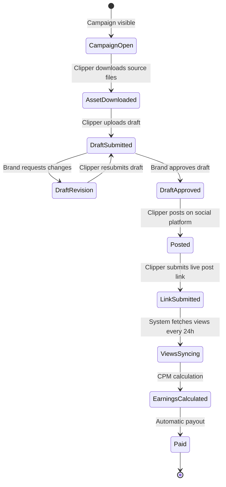

# Windflu Website Exploration And Diagrams

Exploration date: 2026-04-23

Scope: public/unauthenticated Windflu website using `playwright/.auth/windflu-dev-storage.json` with `localStorage.isDev=true`.

Confidence level: 90%

## Exploration Summary

- Homepage exposes brand and creator entry points, a public brand lead form, workflow explanation, and legal/footer links.
- Brand auth has login, registration step 1, and forgot-password flows.
- Creator auth has login and registration entry points.
- Campaign listing exposes cookie consent actions, search, platform/category filters, public campaign cards, protected sidebar links, and campaign detail navigation.
- Campaign detail exposes public campaign information, tabs, revenue calculator, Google Drive asset link, submit clip action, and share action.
- Policy pages are public; privacy content is now `V1.0.6` with update date `23 เมษายน 2569`, while terms remain `V1.0.5`.
- `/contact` currently renders a 404 page with a back-home action.

## Page / Module Inventory

| Area                  | Page / Route                                                     | Visible Modules                                                                          | Notes                                                                      |
| --------------------- | ---------------------------------------------------------------- | ---------------------------------------------------------------------------------------- | -------------------------------------------------------------------------- |
| Homepage              | `/`                                                              | Header nav, hero CTAs, creator workflow, brand lead form, footer links                   | Brand growth CTA scrolls to lead form; clipper CTA routes to creator login |
| Brand Login           | `/brand/login`                                                   | Email, password, visibility toggle, login, register, forgot-password, creator login link | No authenticated dashboard explored                                        |
| Brand Register        | `/brand/register`                                                | Step 1 account fields, password confirmation, phone, next button                         | Step 2 brand info exists but requires valid step 1 progression             |
| Brand Forgot Password | `/brand/forgot-password`                                         | Email field, disabled reset submit until valid input, back-login link                    | Reset email not submitted                                                  |
| Creator Login         | `/login`                                                         | Google login, email login, register link                                                 | Email login sub-flow not expanded                                          |
| Creator Register      | `/register`                                                      | Email, password, confirm password, accept terms, next button                             | Multi-step flow: Account -> Social -> Personal                             |
| Campaign Listing      | `/creator/campaigns`                                             | Sidebar nav, cookie banner, campaign card, search, platform filters, category filters    | Sidebar protected links are visible to unauthenticated users               |
| Campaign Detail       | `/creator/campaigns/69e61d06a282a107c2d34ff0`                    | Header stats, tabs, details, asset link, revenue calculator, budget, submit/share        | Campaign status shown as open                                              |
| Policy                | `/policy?tab=privacy_policy`, `/policy?tab=terms_and_conditions` | Privacy/terms tabs, long legal content, footer links                                     | Campaign nav also links with `type=privacy_policy` variant                 |
| Contact               | `/contact`                                                       | 404 message, back-home button                                                            | Current observed behavior                                                  |

## Transition Flow

| Source                   | Trigger / Condition                        | Destination / Result                    | Notes                                                     |
| ------------------------ | ------------------------------------------ | --------------------------------------- | --------------------------------------------------------- |
| Homepage                 | Click brand nav                            | `/brand/login`                          | Brand portal entry                                        |
| Homepage                 | Click Campaigns nav                        | `/creator/campaigns`                    | Public campaign discovery                                 |
| Homepage                 | Click `สมัครเป็น Clipper`                  | `/login`                                | Creator login entry                                       |
| Homepage                 | Click brand growth CTA                     | Same page lead form section             | Scroll transition                                         |
| Homepage                 | Fill brand lead form and submit            | Expected validation/submission behavior | Backend submission not exercised                          |
| Homepage footer          | Click privacy                              | `/policy?tab=privacy_policy`            | Public legal page                                         |
| Homepage footer          | Click terms                                | `/policy?tab=terms_and_conditions`      | Public legal page                                         |
| Homepage footer          | Click contact                              | `/contact` 404                          | Observed current missing page                             |
| Brand Login              | Click `สมัครฟรี`                           | `/brand/register`                       | Brand registration entry                                  |
| Brand Login              | Click `ลืมรหัสผ่าน?`                       | `/brand/forgot-password`                | Recovery entry                                            |
| Brand Login              | Click creator login link                   | `/login`                                | Switch role entry                                         |
| Brand Register           | Click login link                           | `/brand/login`                          | Back to brand login                                       |
| Brand Register           | Click `ถัดไป` with invalid/mismatched data | Remains on step 1                       | Validation/progression block                              |
| Brand Forgot Password    | Valid email input                          | Reset submit becomes enabled            | Reset action not executed                                 |
| Creator Login            | Click register link                        | `/register`                             | Creator registration entry                                |
| Creator Register         | Click terms/privacy links                  | Policy pages                            | Legal agreement links                                     |
| Campaign Listing         | Click cookie actions                       | Banner action invoked                   | Banner did not reliably disappear during prior automation |
| Campaign Listing         | Search/filter controls                     | Campaign list updates or remains stable | Featured campaign remains visible for unmatched search    |
| Campaign Listing         | Click campaign card / JOIN CAMPAIGN        | Campaign detail route                   | Public detail opens                                       |
| Campaign Listing sidebar | Click dashboard/my-work/payouts/profile    | Protected routes likely require login   | Auth-gate behavior not fully explored                     |
| Campaign Detail          | Click back campaign link                   | `/creator/campaigns`                    | Listing return                                            |
| Campaign Detail          | Click tabs                                 | Same page tab content changes           | Overview, Leaderboard, Analytics                          |
| Campaign Detail          | Enter view count                           | Revenue estimate updates                | `25000` views -> `฿400` at `฿16 / 1K`                     |
| Campaign Detail          | Click Google Drive                         | External Drive folder                   | External content not validated                            |
| Campaign Detail          | Click submit clip                          | Protected/submit action                 | Auth requirement expected but not confirmed               |
| Contact 404              | Click back-home                            | `/`                                     | Recovery path                                             |

## Mermaid Navigation Flow Diagram

```mermaid
flowchart TD
    Home["Homepage /"] -->|Brand nav| BrandLogin["Brand Login /brand/login"]
    Home -->|Campaigns nav| CampaignList["Creator Campaigns /creator/campaigns"]
    Home -->|สมัครเป็น Clipper| CreatorLogin["Creator Login /login"]
    Home -->|Brand growth CTA| LeadForm["Brand Lead Form Section"]
    Home -->|Privacy footer| Privacy["Privacy Policy /policy?tab=privacy_policy"]
    Home -->|Terms footer| Terms["Terms /policy?tab=terms_and_conditions"]
    Home -->|Contact footer| Contact404["Contact /contact 404"]

    LeadForm -->|Empty/invalid submit| LeadValidation["Validation / invalid state"]
    LeadForm -->|Valid submit| LeadSubmit["Lead submit behavior not exercised"]

    BrandLogin -->|สมัครฟรี| BrandRegister["Brand Register /brand/register"]
    BrandLogin -->|ลืมรหัสผ่าน| BrandForgot["Forgot Password /brand/forgot-password"]
    BrandLogin -->|เข้าสู่ระบบในฐานะ Clipper| CreatorLogin
    BrandRegister -->|มีบัญชีแล้ว| BrandLogin
    BrandRegister -->|Invalid or mismatched data| BrandRegisterStep1["Remain on Step 1"]
    BrandForgot -->|กลับไปหน้าเข้าสู่ระบบ| BrandLogin
    BrandForgot -->|Valid email| ResetReady["Reset submit enabled"]

    CreatorLogin -->|สมัครสมาชิก| CreatorRegister["Creator Register /register"]
    CreatorRegister -->|Terms link| Terms
    CreatorRegister -->|Privacy link| Privacy
    CreatorRegister -->|มีบัญชีอยู่แล้ว| CreatorLogin

    CampaignList -->|Search / filters| CampaignList
    CampaignList -->|Cookie actions| CookieState["Cookie preference action"]
    CampaignList -->|Campaign card / JOIN CAMPAIGN| CampaignDetail["Campaign Detail /creator/campaigns/:id"]
    CampaignList -->|Protected sidebar links| CreatorAuthGate["Auth-gated creator areas"]
    CampaignList -->|Official Line Support| LineExternal["External LINE support"]
    CampaignList -->|นโยบาย link| PrivacyVariant["Policy via type=privacy_policy"]

    CampaignDetail -->|กลับหน้าแคมเปญ| CampaignList
    CampaignDetail -->|Overview / Leaderboard / Analytics| CampaignTabs["Campaign tab content"]
    CampaignDetail -->|Revenue input / presets| RevenueCalc["Revenue calculator"]
    CampaignDetail -->|Google Drive| DriveExternal["External Google Drive folder"]
    CampaignDetail -->|ส่ง Clip Campaign| SubmitClip["Submit clip action / likely auth-gated"]
    CampaignDetail -->|แชร์แคมเปญ| ShareAction["Share action"]

    Contact404 -->|กลับสู่หน้าหลัก| Home
```

## Mermaid Creator Registration State Diagram

## Mermaid Campaign Work Lifecycle State Diagram

Derived from homepage workflow copy and campaign detail actions. Some transitions are assumption-based because authenticated submit/review screens were not explored.

## QA Notes

- Public site behavior depends on `localStorage.isDev=true`; without it, the site can show a coming-soon page.
- Privacy content changed since previous exploration: `V1.0.6`, updated `23 เมษายน 2569`.
- `/register` creator registration is now explicitly included in the exploration.
- `/contact` still returns a 404 page.
- Campaign cookie actions are visible, but previous automation showed the banner does not reliably disappear after synthetic accept.
- Campaign unmatched search keeps the featured campaign visible; empty-state expectations should be conservative.
- Authenticated creator areas, brand dashboard, campaign submission, draft review, and payout states remain blocked without test credentials.

## Clarification Points

- Should `/contact` remain a designed 404 or become a real contact page?
- Should campaign submit/share actions require login, modal, or redirect?
- Should creator `/register` be added to test design and implementation coverage?
- Should privacy policy version/date be asserted in tests, or treated as content that can change?
- Are there test accounts for brand and creator authenticated exploration?

## Test Design Handoff

Ready for public unauthenticated test design:

- Homepage and brand lead form
- Brand login/register/forgot-password entry flows
- Creator login/register entry flows
- Campaign listing and campaign detail
- Policy and 404 behavior

Blocked or assumption-based:

- Authenticated dashboards
- Campaign submission and draft review
- Creator work lifecycle after submitting a clip
- Payout/finance behavior
- Brand campaign creation/review flows
