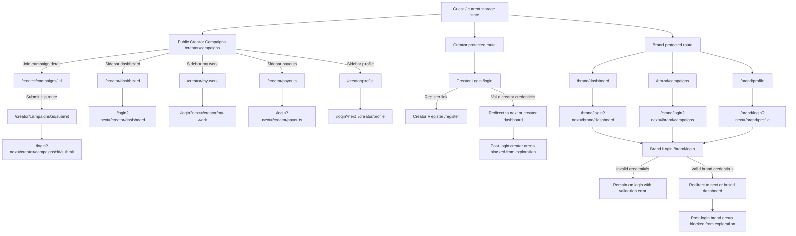
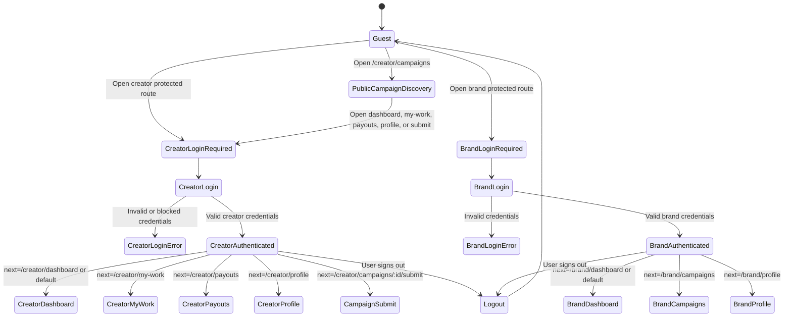

# Windflu Authenticated Area Exploration And Diagrams

Exploration date: 2026-04-23

Scope: authenticated/protected Windflu routes. Initial exploration used
`playwright/.auth/windflu-dev-storage.json` with `localStorage.isDev=true`.
Authenticated test preparation now assumes Playwright global setup has generated
role-specific storage states:

- Creator: `playwright/.auth/windflu-creator-storage.json`
- Brand: `playwright/.auth/windflu-brand-storage.json`

Confidence level: 82%

## Real Authenticated Exploration Status

This document contains guest-state redirect evidence because the role-specific
authenticated storage states are not present in this workspace yet.

Current state of `playwright/.auth/`:

- Present: `windflu-dev-storage.json` (guest only)
- Missing: `windflu-creator-storage.json`
- Missing: `windflu-brand-storage.json`

Action to unblock real authenticated exploration:

- Run Playwright with safe credentials in environment variables so
  `playwright/global-setup.ts` generates role storage states:
  `WINDFLU_CREATOR_EMAIL` / `WINDFLU_CREATOR_PASSWORD` and/or
  `WINDFLU_BRAND_EMAIL` / `WINDFLU_BRAND_PASSWORD`.

Notes:

- Do not commit generated authenticated storage states.
- A durable note is tracked at `.agents/review-notes/authenticated-exploration-note.md`.

## Exploration Summary

- The redirect evidence in this document was collected using a guest storage
  state (no cookies; only `localStorage.isDev=true`).
- Playwright global setup can now create reusable authenticated creator and brand
  storage states when safe credentials are supplied through environment
  variables.
- Authenticated tests should start with `creatorStorageStatePath` or
  `brandStorageStatePath`, not the guest `windflu-dev-storage.json`.
- Creator protected routes redirect to `/login?next=<protected-route>`.
- Brand protected routes redirect to `/brand/login?next=<protected-route>`.
- Public creator campaign listing remains accessible without login, but sidebar
  links to protected creator areas are visible.
- Campaign submit route is protected and redirects to creator login with the
  original submit path preserved in `next`.
- Brand dashboard/campaign/profile routes are protected and redirect to the brand
  login page with the original path preserved in `next`.
- Actual post-login dashboard, work management, payout, profile, campaign
  creation/review, and submission screen details still need a successful
  authenticated exploration pass using generated storage states.

## Authenticated Test Design Preparation

Prepared design file:
`tests/web-ui/authenticated-user/authenticated-user-test-design.md`

Use role-specific storage states in implementation:

```ts
import { test } from '@playwright/test';
import { creatorStorageStatePath } from '../../../playwright/auth-storage';

test.use({ storageState: creatorStorageStatePath });
```

Ready prepared modules:

- Creator authenticated route access: dashboard, my-work, payouts, profile, and
  campaign submit route.
- Brand authenticated route access: dashboard, campaigns, and profile.

Still assumption-based until a real storage state is generated:

- Exact post-login landing pages.
- Page-specific authenticated content and seeded empty states.
- Role-crossing rules between creator and brand areas.
- Submit-flow requirements such as social connection or profile completion.

## Page / Module Inventory

Guest-state observations (this is why you still see redirects to
`/login?next=...` and `/brand/login?next=...` in this file):

| Area                    | Route Probed                                                     | Observed Result                                                        | Notes                                            |
| ----------------------- | ---------------------------------------------------------------- | ---------------------------------------------------------------------- | ------------------------------------------------ |
| Creator Campaigns       | `/creator/campaigns`                                             | Public campaign listing renders                                        | Sidebar exposes protected links                  |
| Creator Dashboard       | `/creator/dashboard`                                             | Guest redirects to `/login?next=%2Fcreator%2Fdashboard`                | Authenticated module blocked in guest state      |
| Creator My Work         | `/creator/my-work`                                               | Guest redirects to `/login?next=%2Fcreator%2Fmy-work`                  | Authenticated module blocked in guest state      |
| Creator Payouts         | `/creator/payouts`                                               | Guest redirects to `/login?next=%2Fcreator%2Fpayouts`                  | Authenticated module blocked in guest state      |
| Creator Profile         | `/creator/profile`                                               | Guest redirects to `/login?next=%2Fcreator%2Fprofile`                  | Authenticated module blocked in guest state      |
| Campaign Submit         | `/creator/campaigns/69e61d06a282a107c2d34ff0/submit`             | Guest redirects to `/login?next=%2Fcreator%2Fcampaigns%2F...%2Fsubmit` | Submit requires creator auth                     |
| Creator Login           | `/login`                                                         | Creator login entry renders Google and email-login options             | No safe credential login executed                |
| Creator Register        | `/register`                                                      | Creator registration step 1 renders                                    | Account, social, personal steps visible          |
| Brand Dashboard         | `/brand/dashboard`                                               | Guest redirects to `/brand/login?next=%2Fbrand%2Fdashboard`            | Authenticated module blocked in guest state      |
| Brand Campaigns         | `/brand/campaigns`                                               | Guest redirects to `/brand/login?next=%2Fbrand%2Fcampaigns`            | Authenticated module blocked in guest state      |
| Brand Profile           | `/brand/profile`                                                 | Guest redirects to `/brand/login?next=%2Fbrand%2Fprofile`              | Authenticated module blocked in guest state      |
| Brand Login             | `/brand/login`                                                   | Brand login form renders                                               | Placeholder credential attempt returns error     |
| Brand Login Invalid Try | `/brand/login` with placeholder-shaped email/password submission | Remains on `/brand/login` and shows `invalid email` validation text    | Confirms invalid auth does not enter brand areas |

Expected behavior when already logged in via global setup (role-specific storage
state):

| Role    | Route(s)                                                                         | Expected Result                                                                                 |
| ------- | -------------------------------------------------------------------------------- | ----------------------------------------------------------------------------------------------- |
| Creator | `/creator/dashboard`, `/creator/my-work`, `/creator/payouts`, `/creator/profile` | Does not redirect to `/login`; creator authenticated shell/page is visible (refine later)       |
| Creator | `/creator/campaigns/69e61d06a282a107c2d34ff0/submit`                             | Does not redirect to `/login`; submit/eligibility/authenticated campaign state appears (refine) |
| Brand   | `/brand/dashboard`, `/brand/campaigns`, `/brand/profile`                         | Does not redirect to `/brand/login`; brand authenticated shell/page is visible (refine later)   |

## Transition Flow

Guest-state redirects (evidence only):

| Source            | Trigger / Condition                        | Destination / Result                                                     | Notes                                         |
| ----------------- | ------------------------------------------ | ------------------------------------------------------------------------ | --------------------------------------------- |
| Creator Campaigns | Click sidebar `ภาพรวม` / direct dashboard  | `/login?next=%2Fcreator%2Fdashboard`                                     | Protected route preserves return destination  |
| Creator Campaigns | Click sidebar `งานของฉัน` / direct my-work | `/login?next=%2Fcreator%2Fmy-work`                                       | Protected route preserves return destination  |
| Creator Campaigns | Click sidebar `การเงิน` / direct payouts   | `/login?next=%2Fcreator%2Fpayouts`                                       | Protected route preserves return destination  |
| Creator Campaigns | Click sidebar `โปรไฟล์` / direct profile   | `/login?next=%2Fcreator%2Fprofile`                                       | Protected route preserves return destination  |
| Campaign Detail   | Direct submit route while unauthenticated  | `/login?next=%2Fcreator%2Fcampaigns%2F69e61d06a282a107c2d34ff0%2Fsubmit` | Submit requires creator authentication        |
| Creator Login     | Successful creator login                   | Expected redirect to `next` or default creator dashboard                 | Blocked: no authenticated creator credentials |
| Creator Login     | Register link                              | `/register`                                                              | Public registration entry                     |
| Brand Dashboard   | Direct access while unauthenticated        | `/brand/login?next=%2Fbrand%2Fdashboard`                                 | Protected route preserves return destination  |
| Brand Campaigns   | Direct access while unauthenticated        | `/brand/login?next=%2Fbrand%2Fcampaigns`                                 | Protected route preserves return destination  |
| Brand Profile     | Direct access while unauthenticated        | `/brand/login?next=%2Fbrand%2Fprofile`                                   | Protected route preserves return destination  |
| Brand Login       | Invalid placeholder credentials            | Remains on `/brand/login`; shows `invalid email`                         | Negative auth behavior observed               |
| Brand Login       | Successful brand login                     | Expected redirect to `next` or default brand dashboard                   | Blocked: no authenticated brand credentials   |

Authenticated-state expectations (for tests that start from storage state):

| Source                | Trigger / Condition                 | Destination / Result                                 | Notes                                        |
| --------------------- | ----------------------------------- | ---------------------------------------------------- | -------------------------------------------- |
| Creator storage state | Navigate to creator protected route | Stays within creator area (no `/login` redirect)     | Assert URL not matching `/login` first       |
| Brand storage state   | Navigate to brand protected route   | Stays within brand area (no `/brand/login` redirect) | Assert URL not matching `/brand/login` first |

## Mermaid Auth Gate Flow Diagram



## Mermaid Authentication State Diagram



## QA Notes

- Auth-gate redirect behavior is ready for test design and automation because it
  is observable without credentials.
- Post-login creator and brand access checks are prepared for global setup
  storage states.
- Detailed authenticated page assertions are not ready until role-specific
  storage states are generated and explored.
- A safe next step is to run Playwright with role credentials in environment
  variables so global setup creates separate creator and brand files under
  `playwright/.auth/`, without committing secrets.
- Login credentials, cookies, OTPs, and recovery links must not be stored in test
  data Markdown, hot cache, or prompt activity log.
- If a created account is used for exploration, record only sanitized account
  metadata in `tests/web-ui/test-data/registered-accounts.md`.

## Clarification Points

Before I can explore the actual authenticated modules, I need input on blocked
areas.

## Access

- Can you provide safe creator and brand test accounts through a secure channel,
  or should we generate accounts in this environment?
- Should authenticated storage states be split by role, for example
  `windflu-creator-storage.json` and `windflu-brand-storage.json`?

## Authentication

- Does creator login require Google OAuth, email/password, OTP, email
  verification, or CAPTCHA?
- Does brand login require approval before dashboard access?

## Roles

- Which roles should be explored first: creator, brand, admin, reviewer, or a
  subset?

## Data / Business Rules

- Is there seeded campaign/work/payout data for authenticated creator flows?
- Is there seeded campaign/review data for authenticated brand flows?

## Test Design Handoff

Ready for test design:

- Creator protected-route auth redirects with `next` preservation.
- Brand protected-route auth redirects with `next` preservation.
- Invalid brand login remains on login and shows validation.

Blocked or assumption-based:

- Creator dashboard, my-work, payouts, profile, and campaign submission internals.
- Brand dashboard, campaign management, profile, creator review, and payment
  internals.
- Logout behavior and role-specific post-login landing pages.
